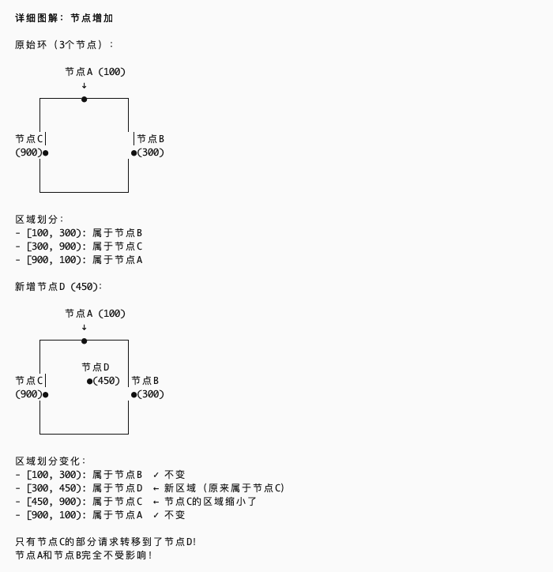

# Yu-RPC-Core 负载均衡设计详解

## 一、负载均衡整体架构

### 1.1 设计概述

Yu-RPC-Core 的负载均衡模块采用 **策略模式 + SPI 机制** 实现，支持多种负载均衡算法的动态切换。负载均衡器在消费端使用，用于从多个可用的服务提供者中选择一个进行调用。

### 1.2 核心接口设计

从 `LoadBalancer.java:13-23` 可以看到负载均衡器的核心接口：

```java
public interface LoadBalancer {
    /**
     * 选择服务调用
     *
     * @param requestParams       请求参数
     * @param serviceMetaInfoList 可用服务列表
     * @return 选中的服务元信息
     */
    ServiceMetaInfo select(Map<String, Object> requestParams, 
                          List<ServiceMetaInfo> serviceMetaInfoList);
}
```

**接口设计要点**：
- **requestParams**: 请求参数（如方法名），用于一致性hash等算法
- **serviceMetaInfoList**: 从注册中心获取的可用服务列表
- **返回值**: 选中的服务实例元信息

### 1.3 服务元信息结构

从 `ServiceMetaInfo.java` 可以看到服务实例的完整信息：

```java
@Data
public class ServiceMetaInfo {
    private String serviceName;      // 服务名称
    private String serviceVersion;   // 服务版本号
    private String serviceHost;      // 服务域名/IP
    private Integer servicePort;     // 服务端口号
    private String serviceGroup;     // 服务分组
    
    // 获取完整服务地址: http://host:port
    public String getServiceAddress() {
        if (!StrUtil.contains(serviceHost, "http")) {
            return String.format("http://%s:%s", serviceHost, servicePort);
        }
        return String.format("%s:%s", serviceHost, servicePort);
    }
}
```

## 二、负载均衡策略实现

我熟悉的几种负载均衡算法：
轮询（Round Robin）：按照循环的顺序将请求分配给每个服务器，适用于各服务器性能相近的情况。
随机（Random）：随机选择一个服务器来处理请求，适用于服务器性能相近且负载均匀的情况。
加权轮询（Weighted Round Robin）：根据服务器的性能或权重分配请求，性能更好的服务器会获得更多的请求，适用于服务器性能不均的情况。
加权随机（Weighted Random）：根据每个服务节点的权重值，按比例随机选择节点。权重越高的节点，被选中的概率越大。
最小连接数（Least Connections）：将新请求分配给当前活跃连接数最少的服务节点。适合长连接
IP Hash：根据客户端 IP 地址的哈希值选择服务器处理请求，确保同一客户端的请求始终被分配到同一台服务器上，适用于需要保持会话一致性的场景。


### 2.1 轮询负载均衡 (Round Robin)

从 `RoundRobinLoadBalancer.java:14-35` 可以看到轮询算法的实现：

```java
public class RoundRobinLoadBalancer implements LoadBalancer {
    /**
     * 当前轮询的下标（使用原子类保证线程安全）
     */
    private final AtomicInteger currentIndex = new AtomicInteger(0);

    @Override
    public ServiceMetaInfo select(Map<String, Object> requestParams, 
                                  List<ServiceMetaInfo> serviceMetaInfoList) {
        if (serviceMetaInfoList.isEmpty()) {
            return null;
        }
        
        // 只有一个服务，无需轮询
        int size = serviceMetaInfoList.size();
        if (size == 1) {
            return serviceMetaInfoList.get(0);
        }
        
        // 取模算法轮询
        int index = currentIndex.getAndIncrement() % size;
        return serviceMetaInfoList.get(index);
    }
}
```

**实现要点**：
- 使用 `AtomicInteger` 保证多线程环境下的线程安全
- `getAndIncrement()` 原子性地获取并递增索引
- 取模运算实现循环轮询
- 优化：单实例直接返回，避免不必要的计算

**适用场景**：
- 服务实例性能相近
- 请求处理时间相对均匀
- 需要均匀分配请求

### 2.2 随机负载均衡 (Random)

从 `RandomLoadBalancer.java:14-30` 可以看到随机算法的实现：

```java
public class RandomLoadBalancer implements LoadBalancer {
    private final Random random = new Random();

    @Override
    public ServiceMetaInfo select(Map<String, Object> requestParams, 
                                  List<ServiceMetaInfo> serviceMetaInfoList) {
        int size = serviceMetaInfoList.size();
        if (size == 0) {
            return null;
        }
        
        // 只有 1 个服务，不用随机
        if (size == 1) {
            return serviceMetaInfoList.get(0);
        }
        
        return serviceMetaInfoList.get(random.nextInt(size));
    }
}
```

**实现要点**：
- 使用 `Random.nextInt(size)` 生成 [0, size) 范围内的随机数
- 简单高效，无状态维护
- 优化：单实例直接返回

**适用场景**：
- 服务实例性能相近
- 无需保证请求顺序
- 追求简单实现

**优缺点**：
- ✅ 实现简单，性能高
- ✅ 在大量请求下趋于均匀分布
- ❌ 短期内可能分布不均
- ❌ 无法保证会话一致性

### 2.3 一致性哈希负载均衡 (Consistent Hash) ⭐

这是本文的重点内容。从 `ConsistentHashLoadBalancer.java:14-62` 可以看到完整实现。

## 三、一致性哈希详解 ⭐⭐⭐

### 3.1 什么是一致性哈希

一致性哈希是一种特殊的哈希算法，主要解决分布式系统中节点动态增减时的数据重新分配问题。

请求参数构造过程
方法名 getUser 计算getHash(getUser)  可以相同服务路由到同一服务
相同请求总是路由到同一服务（有利于缓存）
服务节点增减时，只影响相邻节点（最小化重新映射）

虚拟节点保证负载均衡  
192.168.1.1 生成100个节点 192.168.1.2生成100个节点 192.168.1.3生成100个节点  平均分配到圆环上 保证公平


**传统哈希的问题**：
```
节点选择 = hash(key) % 节点数量
```
当节点数量变化时，几乎所有的映射关系都会改变，导致大量缓存失效。

**一致性哈希的解决方案**：
- 将哈希值空间组织成一个虚拟的环（0 ~ 2^32-1）
- 节点和数据都映射到这个环上
- 数据顺时针找到的第一个节点就是其归属节点
- 节点增减只影响相邻节点，不会引起全局重新映射




### 3.2 核心数据结构

```java
public class ConsistentHashLoadBalancer implements LoadBalancer {
    /**
     * 一致性 Hash 环，存放虚拟节点
     * TreeMap 的 key 是 hash 值，value 是服务实例
     */
    private final TreeMap<Integer, ServiceMetaInfo> virtualNodes = new TreeMap<>();

    /**
     * 虚拟节点数（每个真实节点对应 100 个虚拟节点）
     */
    private static final int VIRTUAL_NODE_NUM = 100;
}
```

**为什么使用 TreeMap？**
- TreeMap 是基于红黑树实现的有序Map
- key 按照自然顺序排序（hash值从小到大）
- 提供 `ceilingEntry(key)` 方法：查找大于等于给定key的最小Entry
- 提供 `firstEntry()` 方法：获取最小的Entry
- 时间复杂度：O(log n)

### 3.3 虚拟节点技术

**为什么需要虚拟节点？**

如果只使用真实节点，当节点数量较少时，会出现：
1. **数据分布不均**：节点在环上的位置可能不均匀
2. **雪崩效应**：某个节点下线，其负载全部转移到下一个节点

**虚拟节点的作用**：
```
真实节点 A → 虚拟节点 A#0, A#1, A#2, ..., A#99
真实节点 B → 虚拟节点 B#0, B#1, B#2, ..., B#99
```

每个真实节点映射为多个虚拟节点，均匀分布在哈希环上，使得：
- 数据分布更加均匀
- 节点下线时，其负载分散到多个其他节点

### 3.4 完整实现流程

```java
@Override
public ServiceMetaInfo select(Map<String, Object> requestParams, 
                              List<ServiceMetaInfo> serviceMetaInfoList) {
    if (serviceMetaInfoList.isEmpty()) {
        return null;
    }

    // ========== 第一步：构建虚拟节点环 ==========
    for (ServiceMetaInfo serviceMetaInfo : serviceMetaInfoList) {
        for (int i = 0; i < VIRTUAL_NODE_NUM; i++) {
            // 为每个服务实例创建 100 个虚拟节点
            // 虚拟节点的 key = "服务地址#序号"
            int hash = getHash(serviceMetaInfo.getServiceAddress() + "#" + i);
            virtualNodes.put(hash, serviceMetaInfo);
        }
    }

    // ========== 第二步：计算请求的哈希值 ==========
    int hash = getHash(requestParams);

    // ========== 第三步：顺时针查找最近的虚拟节点 ==========
    // ceilingEntry: 返回大于等于给定 key 的最小 Entry
    Map.Entry<Integer, ServiceMetaInfo> entry = virtualNodes.ceilingEntry(hash);
    
    if (entry == null) {
        // 如果没有大于等于该 hash 值的节点，说明已经到环的末尾
        // 返回环首部的节点（形成环状结构）
        entry = virtualNodes.firstEntry();
    }
    
    return entry.getValue();
}
```

### 3.5 哈希算法

```java
/**
 * Hash 算法，可自行实现
 * 这里使用 Java 默认的 hashCode() 方法
 */
private int getHash(Object key) {
    return key.hashCode();
}
```

**可选的哈希算法**：
- **Java hashCode()**: 简单快速，但分布性一般
- **MurmurHash**: 性能好，分布均匀，推荐使用
- **MD5/SHA1**: 安全性高，但性能较差
- **FNV Hash**: 简单高效，适合短字符串

### 3.6 一致性哈希工作原理图解

```
                    Hash环 (0 ~ 2^32-1)
                           
                    A#23 (hash=100)
                         ↓
        A#67 ←          ●
      (hash=350)      ╱   ╲
           ●        ╱       ╲
          ╱ ╲     ╱           ╲
        ╱     ● B#12          ●  B#45
      ╱   (hash=50)      (hash=150)
    ●                              ●
  A#89                          Request
(hash=400)                   (hash=120)
    ●                              ●
      ╲                          ╱
        ╲     ● A#34          ●  B#78
          ╲ ╱  (hash=300)  (hash=200)
           ●        ╲           ╱
      B#56 →        ╲       ╱
    (hash=380)        ╲   ╱
                         ●
                    A#12 (hash=250)
```

**查找过程**：
1. 请求 hash=120
2. 顺时针查找：120 → 找到第一个 ≥120 的节点
3. 找到 B#45 (hash=150)
4. 返回真实节点 B

### 3.7 节点变化的影响分析

**场景1：新增节点 C**
```
原来：Request(hash=120) → B#45(hash=150) → 节点B
新增节点C后，假设 C#23(hash=130)
现在：Request(hash=120) → C#23(hash=130) → 节点C
```
只影响 hash 值在 [上一个节点, 新节点] 区间的请求。

**场景2：节点 B 下线**
```
原来：Request(hash=120) → B#45(hash=150) → 节点B
节点B下线后，B的所有虚拟节点被移除
现在：Request(hash=120) → A#23(hash=200) → 节点A
```
只影响原本映射到节点B的请求，且这些请求会分散到多个其他节点（因为B有100个虚拟节点分布在环上）。

### 3.8 一致性哈希的优势

1. **单调性**：节点增加时，不会导致已有的映射关系失效
2. **分散性**：通过虚拟节点技术，实现负载均匀分布
3. **平衡性**：节点变化时，影响范围最小化
4. **会话保持**：相同的请求参数总是路由到同一个节点

### 3.9 在 RPC 中的应用场景

**为什么 RPC 需要一致性哈希？**

1. **有状态服务**：某些服务在内存中维护了状态（如用户会话），需要保证同一用户的请求路由到同一个服务实例

2. **本地缓存**：服务实例有本地缓存，相同的请求路由到同一实例可以提高缓存命中率

3. **数据分片**：按照某个key（如用户ID）进行数据分片，需要保证同一key的请求路由到同一实例

**在 Yu-RPC 中的使用**：

从 `ServiceProxy.java:67-72` 可以看到负载均衡的调用：

```java
// 负载均衡
LoadBalancer loadBalancer = LoadBalancerFactory.getInstance(rpcConfig.getLoadBalancer());

// 将调用方法名作为负载均衡参数
Map<String, Object> requestParams = new HashMap<>();
requestParams.put("methodName", rpcRequest.getMethodName());

ServiceMetaInfo selectedServiceMetaInfo = loadBalancer.select(requestParams, serviceMetaInfoList);
```

**使用方法名作为哈希key的好处**：
- 相同方法的调用会路由到同一个服务实例
- 适合方法级别的缓存优化
- 可以根据业务需求改为其他参数（如用户ID）

### 3.10 一致性哈希的局限性

1. **构建成本**：每次调用都需要重新构建虚拟节点环（可优化为缓存）
2. **内存占用**：虚拟节点数量多时，TreeMap 占用内存较大
3. **哈希冲突**：不同的key可能产生相同的hash值
4. **数据倾斜**：如果请求参数分布不均，仍可能导致负载不均

**优化建议**：
```java
// 优化1：缓存虚拟节点环，避免每次重建
private final Map<String, TreeMap<Integer, ServiceMetaInfo>> virtualNodesCache = new ConcurrentHashMap<>();

// 优化2：使用更好的哈希算法
private int getHash(Object key) {
    return MurmurHash.hash32(key.toString());
}

// 优化3：动态调整虚拟节点数量
private int getVirtualNodeNum(int realNodeNum) {
    return Math.max(100, 1000 / realNodeNum);
}
```

## 四、SPI 机制集成

### 4.1 负载均衡器工厂

从 `LoadBalancerFactory.java:10-31` 可以看到工厂模式的实现：

```java
public class LoadBalancerFactory {
    static {
        // 静态代码块：加载所有负载均衡器实现
        SpiLoader.load(LoadBalancer.class);
    }

    /**
     * 默认负载均衡器（轮询）
     */
    private static final LoadBalancer DEFAULT_LOAD_BALANCER = new RoundRobinLoadBalancer();

    /**
     * 根据 key 获取负载均衡器实例
     */
    public static LoadBalancer getInstance(String key) {
        return SpiLoader.getInstance(LoadBalancer.class, key);
    }
}
```

### 4.2 SPI 配置文件

从 `META-INF/rpc/system/com.yupi.yurpc.loadbalancer.LoadBalancer` 可以看到：

```
roundRobin=com.yupi.yurpc.loadbalancer.RoundRobinLoadBalancer
random=com.yupi.yurpc.loadbalancer.RandomLoadBalancer
consistentHash=com.yupi.yurpc.loadbalancer.ConsistentHashLoadBalancer
```

### 4.3 配置使用

在 `application.properties` 中配置：

```properties
# 选择负载均衡策略
rpc.loadBalancer=consistentHash

# 或者
rpc.loadBalancer=roundRobin
rpc.loadBalancer=random
```

## 五、负载均衡策略对比

| 策略 | 算法复杂度 | 线程安全 | 会话保持 | 适用场景 |
|------|-----------|---------|---------|---------|
| **轮询** | O(1) | ✅ AtomicInteger | ❌ | 服务实例性能相近，无状态服务 |
| **随机** | O(1) | ✅ 无状态 | ❌ | 简单场景，无特殊要求 |
| **一致性哈希** | O(log n) | ⚠️ 需优化 | ✅ | 有状态服务，需要会话保持 |

**选择建议**：
- **无状态服务 + 性能相近**：轮询（默认）
- **无状态服务 + 追求简单**：随机
- **有状态服务 / 本地缓存 / 数据分片**：一致性哈希

## 六、测试用例分析

从 `LoadBalancerTest.java:17-49` 可以看到测试代码：

```java
public class LoadBalancerTest {
    final LoadBalancer loadBalancer = new ConsistentHashLoadBalancer();

    @Test
    public void select() {
        // 请求参数
        Map<String, Object> requestParams = new HashMap<>();
        requestParams.put("methodName", "apple");
        
        // 服务列表
        ServiceMetaInfo serviceMetaInfo1 = new ServiceMetaInfo();
        serviceMetaInfo1.setServiceHost("localhost");
        serviceMetaInfo1.setServicePort(1234);
        
        ServiceMetaInfo serviceMetaInfo2 = new ServiceMetaInfo();
        serviceMetaInfo2.setServiceHost("yupi.icu");
        serviceMetaInfo2.setServicePort(80);
        
        List<ServiceMetaInfo> serviceMetaInfoList = Arrays.asList(
            serviceMetaInfo1, serviceMetaInfo2
        );
        
        // 连续调用 3 次，验证一致性
        ServiceMetaInfo result1 = loadBalancer.select(requestParams, serviceMetaInfoList);
        ServiceMetaInfo result2 = loadBalancer.select(requestParams, serviceMetaInfoList);
        ServiceMetaInfo result3 = loadBalancer.select(requestParams, serviceMetaInfoList);
        
        // 一致性哈希应该保证：相同参数返回相同结果
        Assert.assertEquals(result1, result2);
        Assert.assertEquals(result2, result3);
    }
}
```

**测试要点**：
- 相同的请求参数应该路由到相同的服务实例
- 验证一致性哈希的会话保持特性

## 七、总结

### 7.1 设计亮点

1. **策略模式**：统一接口，易于扩展新的负载均衡算法
2. **SPI 机制**：支持动态加载和配置切换
3. **虚拟节点**：一致性哈希使用虚拟节点技术，解决数据倾斜问题
4. **TreeMap 优化**：利用红黑树的有序性，高效查找最近节点
5. **线程安全**：轮询使用 AtomicInteger 保证并发安全

### 7.2 一致性哈希核心要点

1. **哈希环**：将 hash 值空间组织成环状结构
2. **虚拟节点**：每个真实节点映射为多个虚拟节点，均匀分布
3. **顺时针查找**：请求顺时针找到的第一个节点即为目标节点
4. **TreeMap 实现**：利用 ceilingEntry() 高效查找
5. **会话保持**：相同参数总是路由到同一节点

### 7.3 实际应用建议

**何时使用一致性哈希**：
- ✅ 服务有本地缓存，需要提高缓存命中率
- ✅ 有状态服务，需要会话保持
- ✅ 数据分片场景，按key路由
- ❌ 完全无状态服务，使用轮询更简单高效

**性能优化方向**：
1. 缓存虚拟节点环，避免每次重建
2. 使用更好的哈希算法（如 MurmurHash）
3. 根据节点数量动态调整虚拟节点数
4. 考虑使用加权一致性哈希（根据节点性能分配权重）

### 7.4 扩展方向

1. **加权负载均衡**：根据服务实例的性能分配不同权重
2. **最少连接数**：选择当前连接数最少的实例
3. **响应时间**：选择平均响应时间最短的实例
4. **自适应负载均衡**：根据实时监控数据动态调整策略

---

**参考文献**：
- Consistent Hashing and Random Trees (Karger et al., 1997)
- Dubbo 负载均衡实现
- Nginx 负载均衡算法
